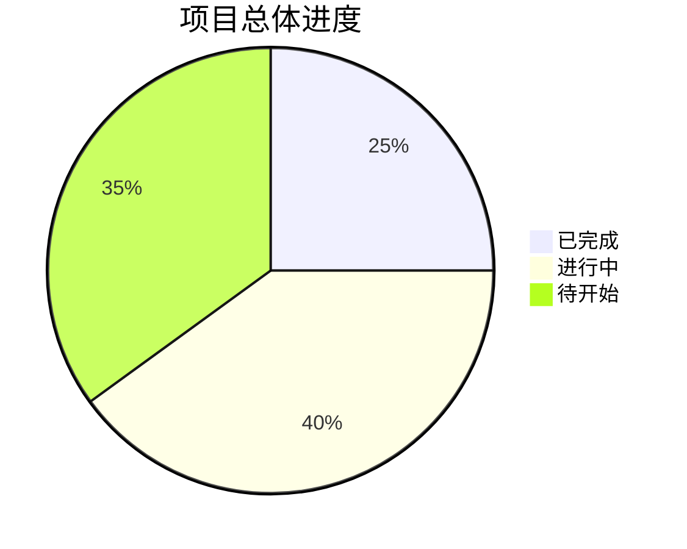
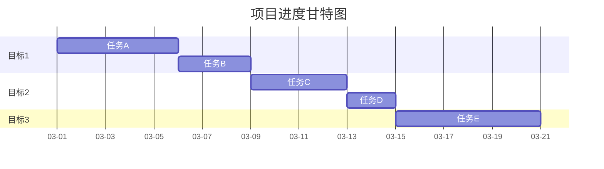

# 📈 目标追踪模板

## 模板说明
- 用于跟踪项目目标的完成情况
- 支持多级目标分解和进度追踪
- 自动计算总体进度和风险预警

## 模板结构

### 1. 目标概览
```yaml
项目: [项目名称]
项目编号: PROJECT-XXX
追踪周期: [YYYY-MM-DD 至 YYYY-MM-DD]
最后更新: [YYYY-MM-DD HH:mm]
更新人: [姓名]
```

### 2. 大目标列表
| 目标编号 | 目标描述 | 优先级 | 状态 | 总进度 | 负责人 | 计划完成 | 实际完成 |
|----------|----------|--------|------|--------|--------|----------|----------|
| G-001 | [目标1描述] | 高 | 🟡 进行中 | 25% | [负责人] | YYYY-MM-DD | - |
| G-002 | [目标2描述] | 中 | 🔴 待开始 | 0% | [负责人] | YYYY-MM-DD | - |
| G-003 | [目标3描述] | 低 | 🟢 已完成 | 100% | [负责人] | YYYY-MM-DD | YYYY-MM-DD |

### 3. 目标详细追踪

#### 目标 G-001: [目标名称]
**目标描述：** [详细描述]
**成功标准：** [可衡量的成功标准]
**关联资源：** [相关文档、工具、人员]

**阶段目标分解：**
| 阶段 | 阶段目标 | 状态 | 进度 | 开始时间 | 计划完成 | 实际完成 | 负责人 |
|------|----------|------|------|----------|----------|----------|--------|
| 阶段1 | [阶段目标1] | ✅ 已完成 | 100% | YYYY-MM-DD | YYYY-MM-DD | YYYY-MM-DD | [负责人] |
| 阶段2 | [阶段目标2] | 🟡 进行中 | 60% | YYYY-MM-DD | YYYY-MM-DD | - | [负责人] |
| 阶段3 | [阶段目标3] | 🔴 待开始 | 0% | - | YYYY-MM-DD | - | [负责人] |

**任务分解：**
| 任务编号 | 任务描述 | 状态 | 进度 | 工时估算 | 实际工时 | 开始时间 | 完成时间 | 负责人 |
|----------|----------|------|------|----------|----------|----------|----------|--------|
| T-001-01 | [任务1] | ✅ 已完成 | 100% | 2天 | 1.5天 | YYYY-MM-DD | YYYY-MM-DD | [负责人] |
| T-001-02 | [任务2] | 🟡 进行中 | 60% | 3天 | 2天 | YYYY-MM-DD | - | [负责人] |
| T-001-03 | [任务3] | 🔴 待开始 | 0% | 1天 | - | - | - | [负责人] |

**关键里程碑：**
- [x] 里程碑1：[描述] (完成时间：YYYY-MM-DD)
- [ ] 里程碑2：[描述] (计划完成：YYYY-MM-DD)
- [ ] 里程碑3：[描述] (计划完成：YYYY-MM-DD)

**风险与问题：**
| 风险等级 | 问题描述 | 影响 | 应对措施 | 负责人 | 解决时限 |
|----------|----------|------|----------|--------|----------|
| 🔴 高 | [高风险问题] | 进度延迟 | [措施] | [负责人] | YYYY-MM-DD |
| 🟡 中 | [中风险问题] | 质量影响 | [措施] | [负责人] | YYYY-MM-DD |
| 🟢 低 | [低风险问题] | 成本增加 | [措施] | [负责人] | YYYY-MM-DD |

---

#### 目标 G-002: [目标名称]
[类似结构...]

---

### 4. 进度统计分析

#### 总体进度


#### 进度趋势
| 时间点 | 总体进度 | 本周进展 | 关键成果 | 主要问题 |
|--------|----------|----------|----------|----------|
| 第1周 | 10% | +10% | [成果1] | [问题1] |
| 第2周 | 25% | +15% | [成果2] | [问题2] |
| 第3周 | 40% | +15% | [成果3] | [问题3] |
| 第4周 | 60% | +20% | [成果4] | [问题4] |

#### 效率指标
- **任务完成率：** 85%
- **平均任务用时：** 2.3天
- **计划偏差率：** +12% (提前)
- **资源利用率：** 78%

### 5. 自动化计算规则

#### 进度计算公式
1. **任务进度** = (实际工时 / 估算工时) × 100% (最大100%)
2. **阶段进度** = Σ(任务进度 × 任务权重) / 总权重
3. **目标进度** = Σ(阶段进度 × 阶段权重) / 总权重
4. **项目进度** = Σ(目标进度 × 目标权重) / 总权重

#### 状态判断规则
- **🔴 待开始：** 进度 = 0%，未开始任何任务
- **🟡 进行中：** 0% < 进度 < 100%，有进行中任务
- **🟢 已完成：** 进度 = 100%，所有任务完成
- **⚠️ 受阻：** 有关键任务受阻超过3天

#### 风险预警规则
- **🔴 高风险：** 进度偏差 > 20% 或 关键路径受阻
- **🟡 中风险：** 10% < 进度偏差 ≤ 20%
- **🟢 低风险：** 进度偏差 ≤ 10%

### 6. 更新机制

#### 每日更新
1. **工作结束时**：更新当天完成的任务
2. **进度变化时**：立即更新相关目标进度
3. **问题发生时**：记录风险并更新状态

#### 每周汇总
1. **每周一**：生成上周进度报告
2. **每周五**：更新本周进度预测
3. **每月底**：生成月度进度分析

#### 自动化更新
1. **任务完成时**：自动计算相关进度
2. **状态变化时**：自动更新风险等级
3. **时间到达时**：自动提醒里程碑

### 7. 可视化输出

#### 进度看板
```
🎯 项目进度看板
├── 📊 总体进度: 40%
├── 🎯 活跃目标: 3个
├── 📋 进行中任务: 8个
├── ⚠️ 风险问题: 2个
└── 📅 近期里程碑: 2个
```

#### 甘特图示例


### 8. 使用说明

#### 初始化步骤
1. 复制本模板到项目目录
2. 填写项目基本信息
3. 分解大目标为阶段目标
4. 分解阶段目标为具体任务
5. 设置任务权重和依赖关系

#### 日常维护
1. 每天更新任务状态
2. 及时记录问题和风险
3. 定期检查进度偏差
4. 调整计划和资源

#### 汇报输出
1. 自动生成进度报告
2. 导出可视化图表
3. 生成决策支持数据
4. 输出风险预警报告

### 9. 最佳实践

#### 进度追踪技巧
1. **分解要细**：任务粒度控制在1-3天
2. **权重合理**：根据重要性设置任务权重
3. **及时更新**：进度变化立即更新
4. **风险预警**：提前识别潜在问题

#### 进度沟通技巧
1. **数据说话**：用具体数据说明进度
2. **可视化展示**：用图表直观展示
3. **问题导向**：重点说明问题和解决方案
4. **行动明确**：明确下一步行动计划

---

**模板版本：** v1.0  
**创建时间：** 2026-03-03  
**最后更新：** 2026-03-03  
**维护人：** 二号