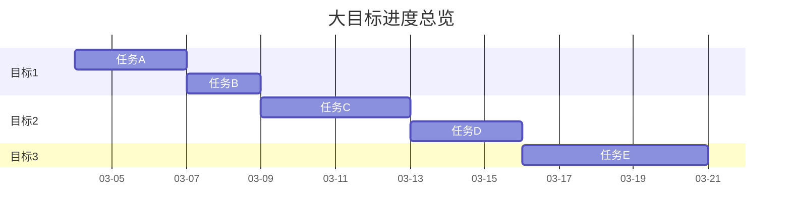

# 📈 目标追踪

## 追踪原则
1. **每日更新**：工作结束时更新进度
2. **问题及时上报**：遇到阻塞立即报告
3. **数据驱动**：用具体数据衡量进度
4. **透明可见**：所有进展对零号可见

## 当前阶段目标

### 🎯 阶段：[阶段名称]
**时间范围：** YYYY-MM-DD 至 YYYY-MM-DD  
**关联大目标：** [目标1]  
**负责人：** 二号  
**状态：** 🟡 进行中

**阶段目标：**
[本阶段要达成的具体目标]

**关键任务：**
| 任务 | 状态 | 开始时间 | 预计完成 | 实际完成 | 负责人 | 备注 |
|------|------|----------|----------|----------|--------|------|
| 任务1 | 🔴 待开始 | - | YYYY-MM-DD | - | 二号 | |
| 任务2 | 🔴 待开始 | - | YYYY-MM-DD | - | 二号 | |
| 任务3 | 🔴 待开始 | - | YYYY-MM-DD | - | 二号 | |

**交付物：**
- [ ] 交付物1
- [ ] 交付物2
- [ ] 交付物3

---

## 进度总览

### 大目标进度

### 本周重点
1. **优先级高**：[任务描述]
2. **关键路径**：[任务描述]  
3. **风险任务**：[任务描述]

### 下周预览
1. [任务描述]
2. [任务描述]
3. [任务描述]

---

## 风险与问题

| 风险等级 | 问题描述 | 影响目标 | 当前状态 | 负责人 | 解决时限 |
|----------|----------|----------|----------|--------|----------|
| 🔴 高 | [问题描述] | 目标1 | 待解决 | 二号 | YYYY-MM-DD |
| 🟡 中 | [问题描述] | 目标2 | 处理中 | 二号 | YYYY-MM-DD |
| 🟢 低 | [问题描述] | 目标3 | 已识别 | 二号 | YYYY-MM-DD |

---

## 每日进展记录

### YYYY-MM-DD
**工作内容：**
- [ ] 任务1：[进展描述]
- [ ] 任务2：[进展描述]
- [ ] 任务3：[进展描述]

**遇到的问题：**
- [问题描述及解决方案]

**明日计划：**
1. [计划1]
2. [计划2]
3. [计划3]

**需要决策：**
- [ ] [决策内容]（需要零号确认）

---

## 数据统计

### 进度指标
- **总任务数：** 0
- **已完成：** 0 (0%)
- **进行中：** 0 (0%)
- **待开始：** 0 (0%)
- **受阻：** 0 (0%)

### 效率指标
- **平均任务完成时间：** [数据]
- **任务完成率：** [数据]
- **问题解决率：** [数据]

---

**最后更新：** YYYY-MM-DD HH:mm  
**下次更新：** 今日工作结束时  
**更新人：** 二号